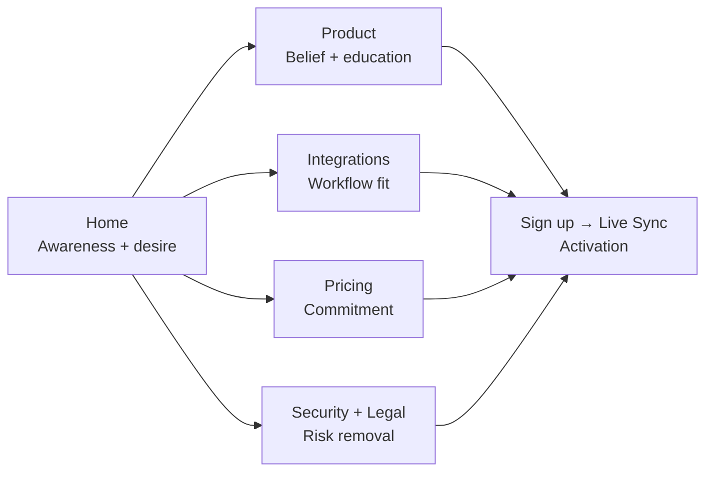

# Lume — MVP Launch Content Strategy

Content strategy for the MVP marketing tier: **Home, Product, Pricing, Integrations hub, Security, Privacy, Terms.**

**North star:** Get a skeptical small-team user to paste a meeting URL and trust you with it. Every page either drives that conversion or removes a blocker.

---

## Positioning

**One-liner**  
Lume is meeting intelligence that feels like a modern product — not a legacy notetaker — with a free tier that actually works for small teams.

**Primary audience**  
Founders, PMs, and eng leads at 2–15 person startups who live in Zoom/Meet/Teams and use Linear or Slack.

**Primary conversion**  
Sign up → Live Sync (paste URL) → first processed meeting in one session.

**Secondary conversion**  
Starter → Studio Pro when they hit limits (5 meetings/month) or need shared workspaces.

**What MVP content must not do**  
Pretend to be enterprise-ready, oversell coming-soon integrations, or compete on feature count with Fireflies. Win on **clarity, craft, and honest limits**.

---

## Messaging hierarchy

Use this order everywhere (hero → subhead → proof):

| Layer | Message |
|-------|---------|
| **Category** | AI meeting notes & action items |
| **Differentiator** | Built for small teams — clean UI, flat pricing, no per-seat trap |
| **Mechanism** | Bot joins your call → transcript + summary + tasks → search & sync |
| **Proof** | Product UI, real limits, Slack/Linear live |
| **Risk reversal** | Free Starter, Security/Privacy pages, transparent bot behavior |

### Tagline directions (pick one lane)

- **Outcome:** “Never re-watch a meeting to remember what was decided.”
- **Anti-incumbent:** “Meeting intelligence that doesn’t feel stuck in 2019.”
- **Workflow:** “From call to Linear in minutes.”

### Words to own vs avoid

| Own | Avoid |
|-----|-------|
| meeting, summary, action items, workspace, sync | revolutionary, game-changing, cutting-edge AI |
| Specific (“Paste a Meet link”) | Vague (“Seamless collaboration”) |

**Voice:** Short sentences, active voice, dark-mode-native product tone (Linear/Vercel adjacency). Confident about what ships; no security theater.

---

## Content pillars

Reuse across all MVP pages. Each pillar = **one screenshot + one sentence**. No pillar without a visual.

1. **Capture** — Live Sync (Zoom, Meet, Teams); uploads as fallback  
2. **Understand** — Summary, key takeaways, speaker-aware transcript  
3. **Act** — Action items; Linear sync (Slack for summaries)  
4. **Find** — Search across meetings in a workspace  
5. **Trust** — Security, privacy, transparent data/AI handling  

---

## Funnel & page roles

| Page | Role | Success metric |
|------|------|----------------|
| **Home** | Hook + route | Click “Start free” or engage product preview |
| **Product** | Teach the loop | CTA click after “How it works” |
| **Integrations** | “Fits my stack” | CTA from Slack/Linear cards |
| **Pricing** | Choose plan | Starter signup; Pro for power users |
| **Security** | De-risk | Fewer pre-signup bounces; fewer safety emails |
| **Privacy / Terms** | Compliance | Linked from signup and footer |

### MVP navigation

Drop Solutions dropdown until phase 2.

**Header:** Product · Integrations · Pricing · Sign in · Start free

---

## Page-by-page strategy

### Home (`/`)

**Goal:** Emotional + rational hook in ~8 seconds; one clear CTA above the fold.

**Hero**  
Lead with **outcome** (decisions and tasks, not “AI transcription”). Subhead names platforms and free start.

**Section order**

1. Hero + CTA  
2. Product preview (real UI, dark mode)  
3. How it works (3 steps, no jargon)  
4. Core capabilities (5 tiles max)  
5. Integrations teaser (Slack + Linear only; “more coming”)  
6. Pricing teaser (Starter free / Studio Pro $25 flat — not per seat)  
7. FAQ (5 questions max)  
8. Final CTA  

**Social proof at MVP**  
If no customers: founder story, build-in-public metrics, or “Designed for teams like yours.” **Do not** use an empty testimonial carousel.

**FAQ must answer**

- Which meeting platforms?  
- Does the bot announce itself?  
- What’s free vs paid?  
- Where does data live / who can access it?  
- How is this different from Fireflies? (one honest paragraph; no compare page yet)

---

### Product (`/product`)

**Goal:** Replace a demo call for technical buyers; deepen belief after Home.

**Narrative arc**  
Meetings evaporate → Capture → Document → Act → Search → Team (workspaces).

**Tactics**

- Annotated screenshots per section  
- Optional: 60–90s silent product video  
- One concrete scenario: “Sprint planning on Meet → summary + tasks in Linear”  
- Security callout + CTA before page end  

**Avoid**  
Feature laundry lists, AI buzzwords, heavy competitor mentions.

---

### Integrations hub (`/integrations`)

**Goal:** Confirm Lume isn’t another silo; drive signup for Linear/Slack users.

**Rules**

- **Hero:** “Push outcomes to Slack and Linear today.”  
- **Above the fold:** Only live integrations with “Connect after signup”  
- **Coming soon:** De-emphasized section (muted cards; no fake Connect buttons)  
- **How delivery works:** One diagram — processed meeting → Slack summary / Linear tasks  

**Per live integration**

- **Slack:** channel summaries, action item highlights  
- **Linear:** tasks with meeting context in description  

**Defer** `/integrations/[slug]` detail pages until phase 2.

---

### Pricing (`/pricing`)

**Goal:** Starter feels generous; Pro feels like the obvious upgrade at scale.

**Framing**

- **Starter:** “Try the full pipeline free” — real limits (5 meetings/mo, storage, single workspace)  
- **Studio Pro:** “For teams that live in meetings” — unlimited meetings, shared workspaces, priority support  
- **Business:** Contact only — no fake price  

**Tactics**

- Comparison table: Starter vs Pro (Business = “Talk to us”)  
- “No per-seat pricing” callout on Pro if accurate  
- Billing FAQ: upgrade, limits, cancellation  

**Critical**  
Every limit must match `packages/types/src/pricing.ts` and live `/billing` behavior.

---

### Security (`/security`)

**Goal:** Unblock signup for PMs and eng leads worried about recordings.

**Structure**

1. What we store (audio, transcript, embeddings)  
2. Where it lives (provider, encryption)  
3. Who can access (workspace roles; training policy — state actual policy)  
4. AI subprocessors (STT, LLM — what’s sent)  
5. Retention & deletion  
6. Links to Privacy + contact  

Plain English. If SOC 2 isn’t done, say “in progress” or omit.

---

### Privacy (`/privacy`) & Terms (`/term`)

**Goal:** Compliance + skim-friendly trust.

**Tactics**

- Plain-language summary at top (5 bullets)  
- Cross-link Security ↔ Privacy  
- Explicitly call out **recordings and transcripts**  
- Effective date and contact emails visible early  

Not optimized for SEO — optimized for signup-flow links.

---

## SEO (light touch)

| Page | Primary intent |
|------|----------------|
| Home | meeting notes AI / AI meeting assistant |
| Product | meeting transcription and summary tool |
| Integrations | Linear meeting notes, Slack meeting summary |
| Pricing | (soft) accessible meeting intelligence pricing in FAQ |
| Security | meeting recording security, data privacy |

**Technical:** Unique title + meta per page; `SoftwareApplication` schema on Home; OG image with product screenshot.

**Skip for MVP:** Blog, compare page, programmatic integration URLs.

---

## Assets checklist

| Asset | Pages |
|-------|-------|
| Hero screenshot (meeting document UI) | Home, Product, OG |
| 3-step “How it works” illustration | Home, Product |
| Slack + Linear logos | Home teaser, Integrations |
| Zoom, Meet, Teams logos | Home |
| 5–7 FAQ answers (legal-reviewed where needed) | Home, Pricing |
| Security facts sheet (internal → public) | Security |
| Plain-language privacy summary | Privacy |

**Copy workflow:** Outline → draft → cut 30% → legal review on Security/Privacy/Pricing limits → ship.

---

## Launch sequence (content)

1. Security + Privacy summaries  
2. Product (source of truth for screenshots/copy)  
3. Home (distill Product for conversion)  
4. Pricing (align with billing)  
5. Integrations hub (live connectors only above fold)  
6. Terms (linked everywhere)  

**Soft launch:** Share Home + Product in founder communities; single CTA — paste a meeting link.

---

## Defer to phase 2

- Solution pages, Fireflies compare, changelog, blog  
- Testimonials you don’t have  
- Business plan marketing beyond “Contact us”  
- Integration detail pages for coming-soon tools  
- Minute-level pricing math in hero (keep limits on Pricing only)

---

## Measurement

| Signal | Insight |
|--------|---------|
| Home → Sign up click rate | Hero/CTA resonance |
| Sign up → first bot dispatch | Promise delivered |
| Pricing → Starter vs Pro | Price anchoring |
| Security views before signup | Trust friction |
| FAQ expand rate | Objections for copy updates |

---

## Creative territories (A/B later)

1. **Memory:** “Your meetings, remembered.”  
2. **Action:** “Calls that end with tasks, not confusion.”  
3. **Modernity:** “Meeting notes for teams who care how software feels.”  
4. **Economics:** “Meeting intelligence without the per-seat tax.”

---

## MVP recommendation

| Page | Lead with |
|------|-----------|
| **Home** | Action + modernity (outcome + UI preview) |
| **Product** | Workflow proof (Meet → Linear) |
| **Pricing** | Honest limits + flat Pro |
| **Integrations** | Slack + Linear only |
| **Security** | Signup unblocker (linked from FAQ + footer) |

---

*See also: [sitemap.md](./sitemap.md)*
