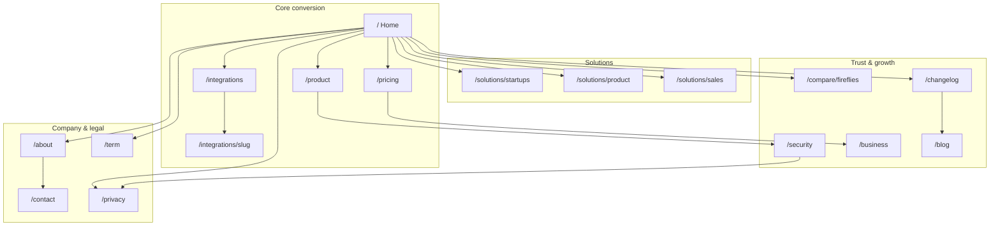

# Lume — Landing Page Sitemap

Production marketing structure for meeting intelligence (record → transcribe → analyze → act). Suggested routes in parentheses.

---

Home (`/`)

Hero
Primary headline, subhead, dual CTA (Start free / See how it works). Position Lume as modern meeting intelligence for small teams.

Logo bar
Trusted-by or “works with” marks for Zoom, Google Meet, Microsoft Teams.

Problem → outcome
Contrast legacy notetaker UX and jump pricing with Lume’s clean UI and accessible plans.

How it works
Join or upload → AI transcript & summary → search and sync to your stack.

Core capabilities
Live Sync bot, transcripts, AI summaries, action items, semantic search, workspaces.

Product preview
Screenshot or loop of the meeting document (overview, takeaways, transcript, tasks).

Integrations teaser
Slack, Linear, plus roadmap tools; link to integrations hub.

Pricing teaser
Starter vs Studio Pro snapshot with link to full pricing.

Social proof
Quotes, ratings, or outcome metrics.

FAQ
Platforms, retention, free limits, bot behavior, security.

Final CTA
Repeat signup; no credit card on Starter.

---

Product (`/product`)

Hero
Everything after the meeting ends — notes, tasks, and search in one place.

Live Sync
Paste Zoom, Google Meet, or Teams URL; bot joins and processes automatically.

Uploads
Import recordings without a bot; same transcription and analysis pipeline.

AI meeting document
Overview, key takeaways, speaker-aware transcript, structured analysis.

Action items & tasks
Extracted follow-ups with assignees; sync to Linear and integrations.

Search
Semantic and full-text search across workspace meetings.

Workspaces & sharing
Team libraries, channels, starred and shared meetings.

Security callout
Encryption and access control; link to Security page.

CTA
Start free or view pricing.

---

Integrations hub (`/integrations`)

Hero
Connect meetings to where work already happens.

Category filters
Team communication, product & engineering, work management, knowledge base, revenue & automation.

Integration grid
Per-tool cards: available (Slack, Linear) vs coming soon (Asana, Jira, Notion, HubSpot, Zapier, etc.).

How delivery works
Summaries and action items pushed after processing completes.

CTA
Sign up; connect from dashboard.

---

Integration detail (`/integrations/[slug]`)

Hero
Tool name, one-line value, connect CTA (auth-gated).

What syncs
Summaries, action items, meeting metadata.

Setup steps
OAuth or webhook flow in 3–4 steps.

Use cases
Example workflows (e.g. Linear sprint, Slack channel).

FAQ
Scopes, permissions, disconnect behavior.

Related integrations
Cross-links to other tools.

---

Pricing (`/pricing`)

Hero
Simple plans for individuals and teams.

Plan cards
Starter (free), Studio Pro ($25/mo), Business (custom) with accurate feature bullets.

Usage limits
Meetings/month, storage, transcription minutes.

Compare table
Feature matrix across plans.

Billing FAQ
Annual billing, upgrades, quotas, cancellation.

CTA
Starter signup; Business book a demo.

---

For startups (`/solutions/startups`)

Hero
Meeting memory your whole team can search.

Pain points
Lost decisions, manual notes, disconnected tools.

Outcomes
Async summaries, searchable archive, tasks in sprint tools.

CTA
Start free on Starter.

---

For product teams (`/solutions/product`)

Hero
From standup to retro — decisions and tasks in Linear.

Workflow
Live Sync → meeting doc → push tasks to Linear.

CTA
Integrations or start free.

---

For sales (`/solutions/sales`)

Hero
Capture what was promised on every call.

Outcomes
Call summaries, follow-ups, CRM logging when integrations ship.

CTA
Business demo or Starter signup.

---

Compare Fireflies (`/compare/fireflies`)

Hero
Modern UI and pricing built for small teams.

Comparison table
UI, pricing, free tier, integrations, search, workspaces.

Migration
Upload past recordings or start fresh.

CTA
Start free.

---

Security (`/security`)

Hero
How Lume protects meeting data.

Data handling
Storage, processing pipeline, retention, deletion.

Access control
Workspace roles; Google, Microsoft, email auth; 2FA.

AI processing
What goes to STT/LLM providers; data minimization.

Compliance
Honest roadmap (SOC 2, GDPR) for stage.

CTA
Privacy Policy; security contact.

---

Business (`/business`)

Hero
Enterprise controls for scaling teams.

Capabilities
SSO & SAML, admin governance, SLA support, onboarding, scalable storage.

CTA
Book a demo.

---

Changelog (`/changelog`)

Hero
Product and integration updates.

Release list
Dated entries: title plus short description.

---

Blog (`/blog`) — phase 2

Index
SEO content: meeting hygiene, async teams, integration guides.

Post
Title, author, date, body, related posts, CTA.

---

About (`/about`)

Hero
Accessible meeting intelligence with modern product craft.

Mission
Small teams deserve strong outcomes without enterprise friction.

CTA
Contact or careers placeholder.

---

Contact (`/contact`)

Hero
Support, sales, partnerships.

Form
Topic, message, email; route to correct inbox.

---

Privacy Policy (`/privacy`)

Hero
How Lume handles recordings, transcripts, and personal data.

Sections
Match existing marketing legal content.

---

Terms of Service (`/term`)

Hero
Terms governing use of Lume.

Sections
Match existing marketing legal content.

---

Global chrome (all pages)

Header
Logo, Product, Integrations, Pricing, Solutions dropdown, Sign in, Start free.

Footer
Product, Solutions, Integrations, Pricing, Security, Privacy, Terms, Changelog, Contact, social.

Meta
Per-page title, description, OG; SoftwareApplication schema on Home and Product.

---

## Launch priority

**MVP:** Home, Product, Pricing, Integrations hub, Privacy, Terms, Security.

**Phase 2:** Solution pages, Compare, integration detail pages, Business, Changelog, Blog.

---

## Sitemap visualization

